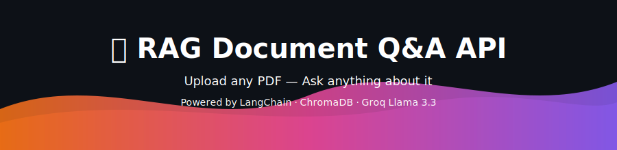

<div align="center">



<br/>

[](https://rag-document-qa-lemon.vercel.app/)
[](https://rag-document-qa-m86f.onrender.com/docs)
[](https://github.com/adityakr09)
[](https://linkedin.com/in/aditya-kumar-O1)

<br/>


<br/>

> **Built by — [Aditya Kumar](https://github.com/adityakr09)**

</div>

---

## ✨ What is this?

**RAG Document Q&A** is a production-ready API that lets you **upload any PDF** and instantly ask natural language questions about its content — no hallucinations, only answers grounded in your document.

Under the hood it runs a full **Retrieval-Augmented Generation (RAG)** pipeline:
- 📄 Parses & chunks your PDF intelligently
- 🧠 Embeds chunks using HuggingFace's `all-MiniLM-L6-v2`
- 🗄️ Stores & retrieves vectors with **ChromaDB**
- ⚡ Generates answers with **Groq Llama 3.3-70B** — blazing fast

---

## 🏗️ Architecture

```
┌─────────────────────────────────────────────────────┐
│                   PDF Upload Flow                   │
│                                                     │
│  User uploads PDF                                   │
│        │                                            │
│        ▼                                            │
│  PyPDFLoader ──► splits into chunks                 │
│        │                                            │
│        ▼                                            │
│  HuggingFace Embeddings (all-MiniLM-L6-v2)          │
│        │                                            │
│        ▼                                            │
│  ChromaDB ──► stores vectors (persistent)           │
└─────────────────────────────────────────────────────┘

┌─────────────────────────────────────────────────────┐
│                  Question Flow                      │
│                                                     │
│  User asks a question                               │
│        │                                            │
│        ▼                                            │
│  ChromaDB ──► retrieves top 4 relevant chunks       │
│        │                                            │
│        ▼                                            │
│  Groq Llama 3.3-70B ──► generates grounded answer   │
│        │                                            │
│        ▼                                            │
│  FastAPI ──► returns answer + source page numbers   │
└─────────────────────────────────────────────────────┘
```

---

## 🛠️ Tech Stack

| Layer | Technology | Purpose |
|-------|-----------|---------|
| **Backend** | Python 3.11, FastAPI, Uvicorn | REST API server |
| **RAG Pipeline** | LangChain, LangChain-Groq | Document loading & chaining |
| **Vector DB** | ChromaDB (persistent) | Store & retrieve embeddings |
| **Embeddings** | HuggingFace `all-MiniLM-L6-v2` | Convert text → vectors |
| **LLM** | Groq `llama-3.3-70b-versatile` | Answer generation |
| **Frontend** | React 18 | Upload UI & chat interface |
| **Hosting** | Vercel + Render | Frontend + Backend deploy |

---

## 🚀 Getting Started

### Prerequisites

- Python 3.11+
- Node.js 18+
- Groq API key → [Get one free](https://console.groq.com)

### 1️⃣ Clone the repo

```bash
git clone https://github.com/adityakr09/rag-document-qa.git
cd rag-document-qa
```

### 2️⃣ Backend Setup

```bash
cd backend
cp .env.example .env
# Add your GROQ_API_KEY to .env
pip install -r requirements.txt
uvicorn main:app --reload --port 8000
```

> 🟢 Backend: `http://localhost:8000` · Swagger Docs: `http://localhost:8000/docs`

### 3️⃣ Frontend Setup

```bash
cd frontend
npm install
npm start
```

> 🟢 Frontend: `http://localhost:3000`

---

## 🌐 API Endpoints

| Method | Endpoint | Description |
|--------|----------|-------------|
| `GET` | `/` | Health check |
| `POST` | `/upload` | Upload a PDF document |
| `POST` | `/ask` | Ask a question about the document |
| `GET` | `/collections` | List all stored collections |
| `DELETE` | `/collections/{name}` | Delete a collection |

### Example Usage

**Upload a PDF:**
```bash
curl -X POST "http://localhost:8000/upload" \
  -H "accept: application/json" \
  -F "file=@your_document.pdf"
```

**Ask a question:**
```bash
curl -X POST "http://localhost:8000/ask" \
  -H "Content-Type: application/json" \
  -d '{"question": "What is the main topic of this document?", "collection": "your_collection"}'
```

**Sample Response:**
```json
{
  "answer": "The document discusses...",
  "source_pages": [2, 5, 11],
  "model": "llama-3.3-70b-versatile"
}
```

---

## 💡 How RAG Works

> [!NOTE]
> **RAG = Retrieval-Augmented Generation** — instead of relying on the LLM's training data, we retrieve relevant context from *your* document and feed it to the model. Answers are always grounded in what you uploaded.

```
Without RAG  →  LLM guesses from training data  →  Hallucinations ❌
With RAG     →  LLM reads YOUR document context  →  Accurate answers ✅
```

---

## 📝 Notes

> [!IMPORTANT]
> A valid **`GROQ_API_KEY`** is required in `.env` for the LLM to work.

> [!NOTE]
> ChromaDB stores vectors **persistently** — your uploaded documents survive server restarts.

> [!WARNING]
> CORS is open (`*`) in development — **restrict to your frontend domain in production**.

---

<div align="center">


**Made with ❤️ by [Aditya Kumar](https://github.com/adityakr09)**

[](https://github.com/adityakr09)

</div>
